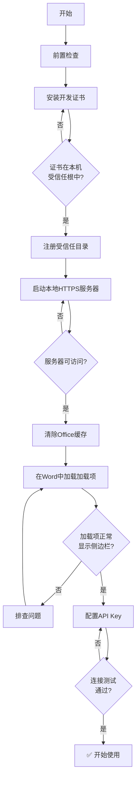
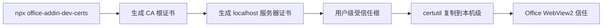
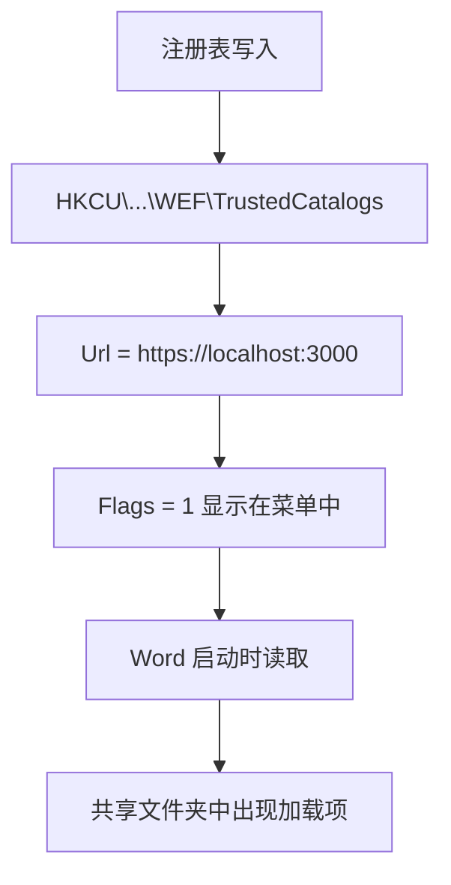
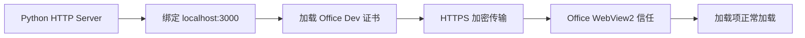
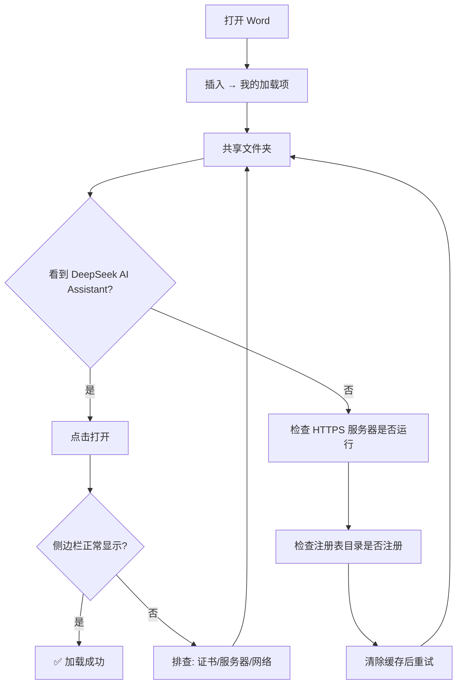
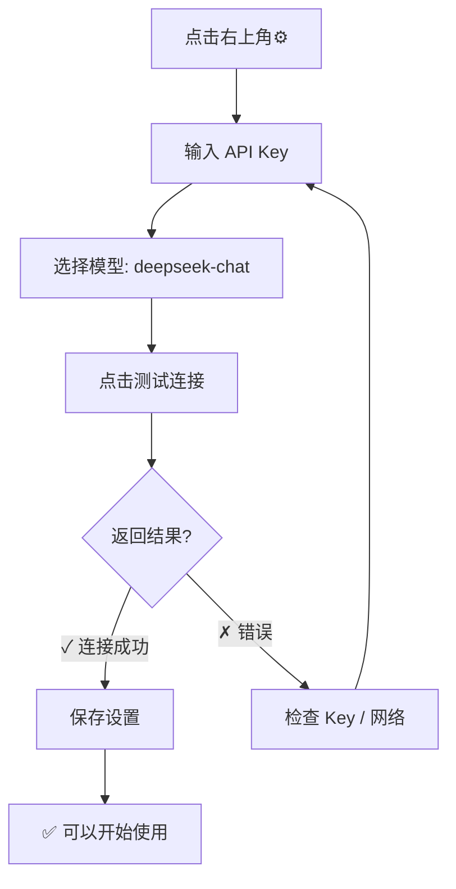
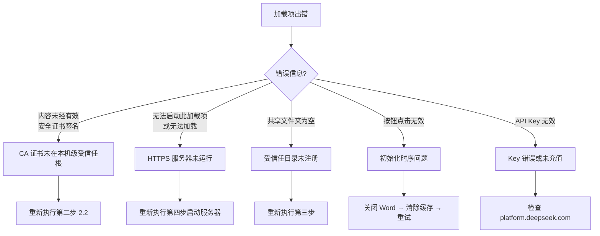

# DeepSeek for Word — 完整部署指南

从零开始，每一步都可验证。预计耗时 **10 分钟**。

---

## 概览



---

## 第一步：前置检查

打开 **PowerShell**（`Win + R` → 输入 `powershell` → 回车），逐条验证：

```powershell
# 1. Node.js（用于安装证书）
node --version
# 期望输出: v24.x.x 或类似版本号

# 2. Python
python --version
# 期望输出: 3.x.x

# 3. 项目目录存在
Test-Path C:\Users\Wangelus\deepseek-for-office\manifest.xml
# 期望输出: True
```

> 如果 `node` 未安装，去 [nodejs.org](https://nodejs.org) 下载 LTS 版本。
> 如果 `python` 未安装，去 [python.org](https://python.org) 下载。

---

## 第二步：安装开发证书

Office 加载项的 WebView2 引擎要求加载项内容必须通过 HTTPS 提供，且证书必须被本机信任。



### 2.1 生成证书

```powershell
npx office-addin-dev-certs install --days 365
```

输出应包含：
```
Certificate: C:\Users\Wangelus\.office-addin-dev-certs\localhost.crt
Key: C:\Users\Wangelus\.office-addin-dev-certs\localhost.key
```

### 2.2 安装到本机受信任根（**关键步骤**）

这是最容易出错的环节。Office 2024 的 Edge WebView2 **只信任本机级（Local Machine）受信任根证书颁发机构**，用户级（Current User）不够。

```powershell
certutil -addstore Root "$env:USERPROFILE\.office-addin-dev-certs\ca.crt"
```

输出应包含 `CertUtil: -addstore 命令成功完成`。

### 2.3 验证证书

```powershell
npx office-addin-dev-certs verify
```

期望输出：`You have trusted access to https://localhost.`

```powershell
# 双重确认 CA 证书在本机级根存储中
certutil -store Root | Select-String "Developer CA for Microsoft Office Add-ins"
```

如果没有输出，说明上一步 `certutil -addstore Root` 未成功（需要管理员权限）。

---

## 第三步：注册受信任目录

Office 需要知道去哪里找加载项的清单文件（manifest.xml）。



在 PowerShell 中执行：

```powershell
python -c "
import winreg, uuid
base = r'Software\Microsoft\Office\16.0\WEF\TrustedCatalogs'
guid = '{' + str(uuid.uuid4()).upper() + '}'
key = winreg.CreateKey(winreg.HKEY_CURRENT_USER, f'{base}\\{guid}')
winreg.SetValueEx(key, 'Id', 0, winreg.REG_SZ, guid)
winreg.SetValueEx(key, 'Url', 0, winreg.REG_SZ, 'https://localhost:3000')
winreg.SetValueEx(key, 'Flags', 0, winreg.REG_DWORD, 1)
winreg.CloseKey(key)
print('受信任目录已注册: ' + guid)
"
```

验证：

```powershell
reg query "HKCU\Software\Microsoft\Office\16.0\WEF\TrustedCatalogs"
```

应看到一条或多条记录，其中有一条的 `Url` 值为 `https://localhost:3000`。

---

## 第四步：启动本地 HTTPS 服务器



### 4.1 编写服务器脚本

项目目录下已有 `.certs` 目录。在 PowerShell 中启动：

```powershell
cd C:\Users\Wangelus\deepseek-for-office

python -c "
import http.server, ssl

CERT = r'$env:USERPROFILE\.office-addin-dev-certs\localhost.crt'
KEY  = r'$env:USERPROFILE\.office-addin-dev-certs\localhost.key'

class H(http.server.SimpleHTTPRequestHandler):
    def end_headers(self):
        self.send_header('Access-Control-Allow-Origin', '*')
        super().end_headers()
    def log_message(self, f, *a):
        print(f'[HTTPS] {a[0]}')

ctx = ssl.SSLContext(ssl.PROTOCOL_TLS_SERVER)
ctx.load_cert_chain(CERT, KEY)
srv = http.server.HTTPServer(('localhost', 3000), H)
srv.socket = ctx.wrap_socket(srv.socket, server_side=True)
print('HTTPS server: https://localhost:3000')
srv.serve_forever()
"
```

> ⚠️ 保持此窗口打开，不要关闭。以后每次使用加载项前都要先执行这一步。

### 4.2 验证服务器

打开浏览器，访问 `https://localhost:3000/taskpane.html`。如果地址栏显示 **🔒 锁图标**（无证书警告），说明一切正常。你应该能看到加载项的 HTML 界面。

或者在另一个 PowerShell 窗口验证：

```powershell
curl.exe -sk https://localhost:3000/manifest.xml
```

---

## 第五步：清除缓存并加载

### 5.1 清除 Office 加载项缓存


1. **关闭所有 Word/Excel/PowerPoint 窗口**
2. 文件资源管理器地址栏输入并回车：
   ```
   %LOCALAPPDATA%\Microsoft\Office\16.0\Wef\
   ```
3. `Ctrl + A` 全选 → `Delete` 删除

### 5.2 加载加载项

1. 打开 **Word**
2. **插入** 选项卡 → **我的加载项**
3. 顶部切换到 **共享文件夹**
4. 点击 **DeepSeek AI Assistant**



**预期效果**：Word 右侧出现侧边栏，显示 DeepSeek AI 写作助手界面。

---

## 第六步：配置 API Key



1. 在侧边栏右上角点击 **⚙️ 齿轮图标**
2. 填入 **DeepSeek API Key**（在 [platform.deepseek.com](https://platform.deepseek.com) → API Keys 获取，格式为 `sk-xxxx`）
3. 模型选择 **deepseek-chat**（通用对话）
4. 点击 **测试连接**，确认显示 `✓ 连接成功！`
5. 点击 **保存设置**

---

## 第七步：常用操作速查

### 快捷按钮

| 按钮 | 操作方式 | 场景 |
|------|----------|------|
| **校对** | 在文档中选文字 → 点按钮 | 检查语法、流畅度、措辞 |
| **起草** | 输入框描述需求 → 点按钮 | 从零生成内容 |
| **翻译** | 选中英文/中文 → 点按钮 | 自动检测语言并互译 |
| **总结** | 选中长段落 → 点按钮 | 提取要点生成列表 |

### 聊天模式

底部输入框直接打字，按 **Enter** 发送：
- "请用中文写一段500字的项目总结报告开头"
- "把这段文字改得更正式一些：[粘贴文字]"
- "文档里的数据能帮我分析一下趋势吗？"

### 写入文档

AI 回复下方有两个按钮：
- **插入到文档** → 写入 Word 光标位置
- **复制** → 复制到剪贴板

---

## 后续日常使用

每天使用时只需：

```powershell
# 终端中启动服务器
cd C:\Users\Wangelus\deepseek-for-office
python -c "..."  # 同上第四步的完整命令
```

然后 Word → 插入 → 我的加载项 → 共享文件夹 → 打开。

> 可将第四步的 Python 命令保存为 `start-server.ps1` 脚本，之后右键"使用 PowerShell 运行"即可。

---

## 排查指南



### 常见错误速查

| 错误信息 | 原因 | 解决 |
|----------|------|------|
| 内容未经有效安全证书签名 | CA 证书不在本机级根存储 | `certutil -addstore Root "path\to\ca.crt"` |
| 无法启动此加载项 | HTTPS 服务器未运行 / 端口被占 | 重启服务器，检查 `netstat -ano \| findstr 3000` |
| 共享文件夹中无加载项 | 注册表目录未写入或 URL 不匹配 | 重新执行第三步 Python 脚本 |
| 按钮点击无反应 | Office 缓存了旧版清单 | 删除 `%LOCALAPPDATA%\Microsoft\Office\16.0\Wef\*` |
| API 连接测试失败 | Key 无效 / 网络不通 | 确认 Key 以 `sk-` 开头，检查代理设置 |

---

## 一键安装脚本（可选）

将以下内容保存为 `install.ps1`，右键 → **使用 PowerShell 运行**，即可自动完成第二、三步：

```powershell
Write-Host "=== DeepSeek for Word 自动安装 ===" -ForegroundColor Cyan

# 安装证书
Write-Host "[1/3] 安装开发证书..." -ForegroundColor Yellow
npx office-addin-dev-certs install --days 365
certutil -addstore Root "$env:USERPROFILE\.office-addin-dev-certs\ca.crt"

# 注册目录
Write-Host "[2/3] 注册受信任目录..." -ForegroundColor Yellow
python -c "
import winreg, uuid
base = r'Software\Microsoft\Office\16.0\WEF\TrustedCatalogs'
guid = '{' + str(uuid.uuid4()).upper() + '}'
key = winreg.CreateKey(winreg.HKEY_CURRENT_USER, f'{base}\\{guid}')
winreg.SetValueEx(key, 'Id', 0, winreg.REG_SZ, guid)
winreg.SetValueEx(key, 'Url', 0, winreg.REG_SZ, 'https://localhost:3000')
winreg.SetValueEx(key, 'Flags', 0, winreg.REG_DWORD, 1)
winreg.CloseKey(key)
print('Registered: ' + guid)
"

# 清除缓存
Write-Host "[3/3] 清除 Office 缓存..." -ForegroundColor Yellow
Remove-Item -Recurse -Force "$env:LOCALAPPDATA\Microsoft\Office\16.0\Wef\*" -ErrorAction SilentlyContinue

Write-Host "=== 安装完成 ===" -ForegroundColor Green
Write-Host "接下来请执行: cd C:\Users\Wangelus\deepseek-for-office 并启动服务器"
```
