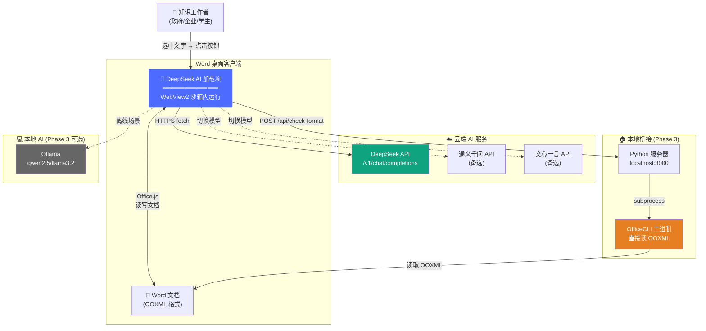
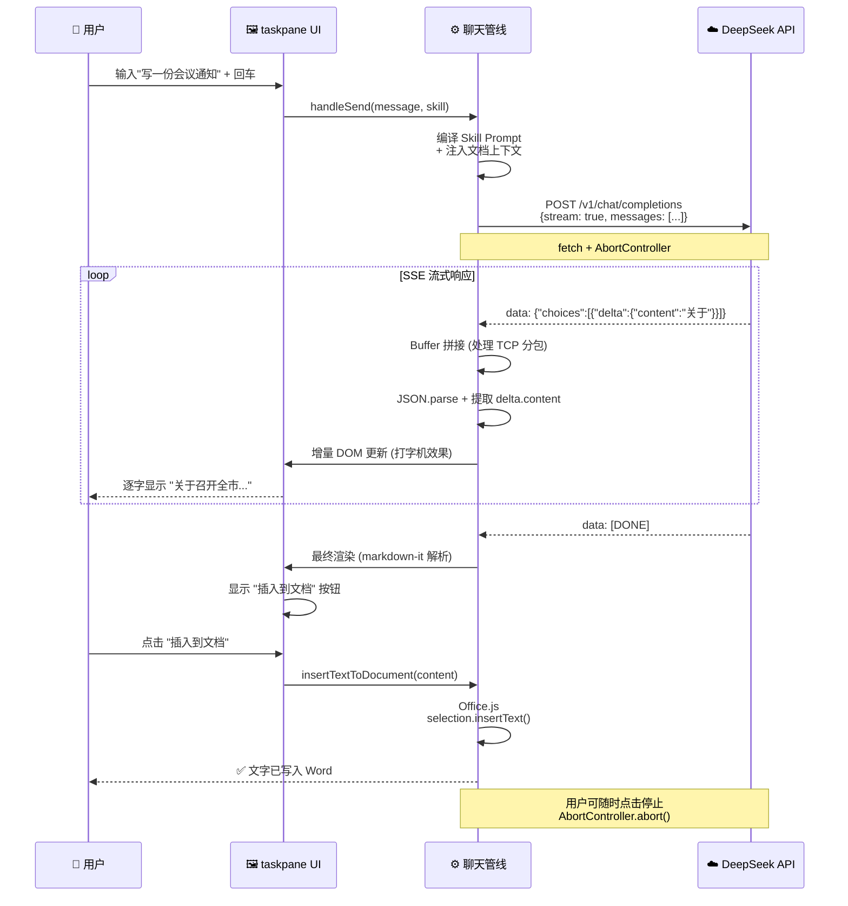
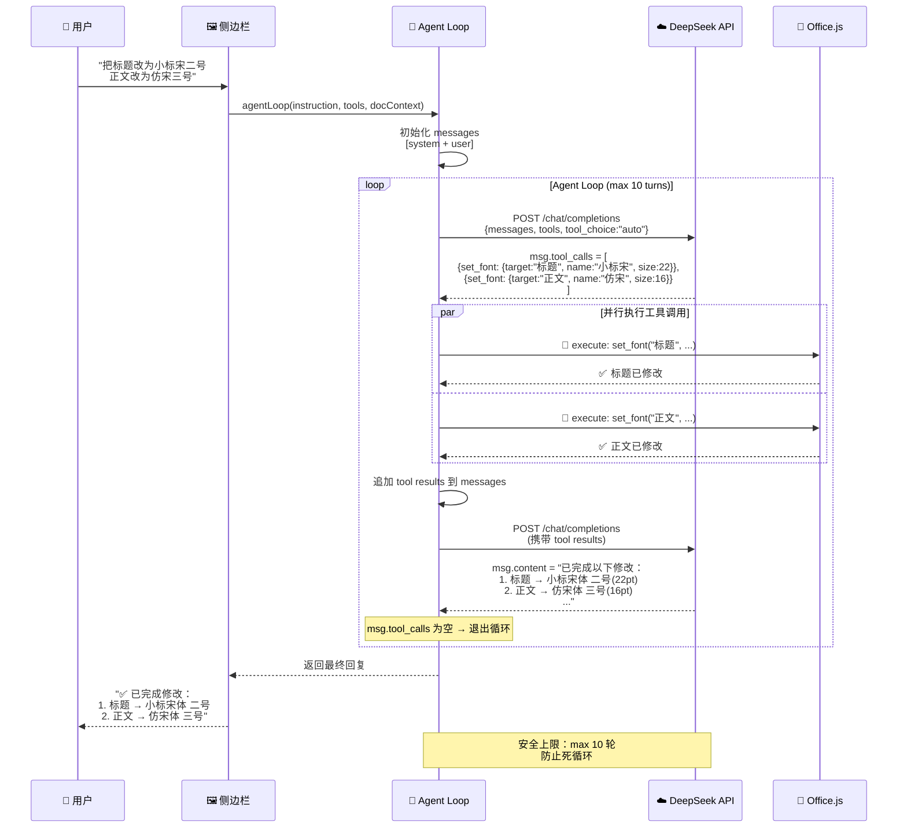

# 技术栈开发文档

> **核心原则**：遇到问题先搜索现有轮子，不重复造轮子。每个技术选型都标注了"调研过的替代方案"和"最终选择理由"。

---

## 一、架构总览

### 1.1 系统上下文（C4 Level 1）



加载项内部按 **UI 层 → 业务逻辑层 → 数据/通信层** 三层架构组织，详见代码结构（[[../taskpane.html|taskpane.html]]、[[../taskpane.js|taskpane.js]]）。

---

## 二、Phase 1 技术栈（当前已完成 ✅）

Phase 1 实现了最小可行产品：DeepSeek API 集成到 Word 侧边栏，提供校对/起草/翻译/总结四个快捷操作 + 聊天模式。

### 2.1 运行时环境

| 组件 | 选型 | 调研过的替代方案 | 选择理由 |
|:---|:---|:---|:---|
| **加载项类型** | Word Web Add-in (taskpane) | VSTO/COM 加载项 | Web Add-in 跨平台（Windows/Mac/Web），通过 Office 商店分发；VSTO 仅 Windows 且需 .msi 安装 |
| **浏览器引擎** | Edge WebView2（Office 内置） | IE11 (旧版 Office) | 2016+ 版本内置，支持现代 ES6+、fetch、localStorage |
| **本地服务器** | Python `http.server` + SSL | Node.js express, npx serve | Python 零依赖，用户已装 Python（DEPLOY.md 已依赖），项目只需静态文件托管 |
| **HTTPS 证书** | `office-addin-dev-certs` | 自签 OpenSSL | 微软官方工具链，一键生成 + 自动配置 |

### 2.2 前端技术

| 组件              | 选型                 | 调研过的替代方案                                                   | 选择理由                                                      |
| :-------------- | :----------------- | :--------------------------------------------------------- | :-------------------------------------------------------- |
| **UI 框架**       | 原生 HTML/CSS/JS     | React + Fluent UI, Vue 3                                   | Phase 1 只有一个 taskpane 页面，无路由/状态管理需求，引入框架反而增加构建链复杂度        |
| **Office API**  | Office.js (CDN 引入) | —                                                          | 唯一官方支持的 Word JavaScript API                               |
| **Markdown 渲染** | 自写简易正则渲染           | **marked** (30KB), **markdown-it** (40KB), showdown (50KB) | Phase 1 只需支持粗体/斜体/标题/列表/代码块，正则足够；Phase 2 将切换到 markdown-it |
| **API 通信**      | `fetch` + JSON     | axios                                                      | 原生 API，零依赖，WebView2 完整支持                                  |

### 2.3 AI 服务

| 组件 | 选型 | 调研过的替代方案 | 选择理由 |
|:---|:---|:---|:---|
| **大模型 API** | DeepSeek API (`/v1/chat/completions`) | OpenAI, Claude, 通义千问 | OpenAI 兼容接口 → 切换成本为零；中文能力强；成本极低 |
| **通信协议** | REST (非流式) | SSE 流式 | Phase 1 追求简单可靠，非流式对短回复延迟可接受；Phase 2 将升级为 SSE 流式 |
| **API Key 存储** | `localStorage` | IndexedDB, sessionStorage | WebView2 为每个加载项提供隔离的 localStorage，数据不过期 |

### 2.4 数据持久化

| 组件 | 选型 | 选择理由 |
|:---|:---|:---|
| **设置存储** | `localStorage` | API Key、模型选择、Endpoint — 简单 KV 对 |
| **聊天历史** | `localStorage`（最近 50 条） | 超过 50 条自动裁剪，防止存储溢出 |

---

## 三、Phase 2 技术栈（核心差异化 — 当前开发重点）

Phase 2 目标：长文本处理 + 文风 Skill 系统 + 基础格式检查 + Markdown 增强渲染。核心交互路径为：用户操作 → Skill 编译 Prompt → (可选) 长文本分段 → DeepSeek API → SSE 流式渲染 → 一键插入文档 → (可选) 格式检查。

### 3.1 前端 UI 升级（可选决策点）

**问题**：当前原生 JS 代码 ~700 行，Phase 2 将增加 Skill 选择器、格式检查面板、设置页面复杂化 → 代码量预计翻 3-5 倍。

**调研结论**：

| 方案 | 包大小 | 优势 | 劣势 |
|:---|:---|:---|:---|
| **保持原生 JS** | 0 KB | 零依赖，代码完全可控 | 大型 UI 维护困难，无生态复用 |
| **React + Fluent UI React** ⭐ | ~40 KB (gzip) | 微软官方推荐的 Office 加载项框架；Fluent UI 组件自带 Office 原生外观；社区模板丰富 | 引入构建工具链（Vite/Webpack） |
| **Vue 3 + 自写 CSS** | ~30 KB (gzip) | 轻量，响应式系统优秀 | Fluent UI 无 Vue 版本，需自写 Office 风格样式 |
| **Svelte** | ~2 KB (gzip) | 编译后几乎无运行时 | 生态小，无 Office 主题库 |

> **推荐方案**：**React + Fluent UI React**。理由：
> 1. 微软官方 Yeoman 生成器 (`yo office`) 原生支持 React 模板，脚手架零成本
> 2. Fluent UI React 提供 `TextField`、`Dropdown`、`Panel`、`MessageBar` 等 80+ 组件，直接复用，外观与 Office 原生 UI 一致
> 3. [Office Add-in UX 设计模式模板](https://learn.microsoft.com/en-us/office/dev/add-ins/design/ux-design-pattern-templates) 全部基于 Fluent UI — 等于微软已提供"标准答案"
> 4. 构建工具 Vite 已完美支持 Office Add-in 开发（`vite-plugin-office-addin`）
> 
> **决策建议**：Phase 2 开始前进行 React 迁移，一次投入，后续 Phase 3 Agent 面板、Skill 市场等复杂 UI 都可以复用 Fluent UI 组件。

### 3.2 Markdown 渲染增强

**问题**：当前自写的正则 Markdown 渲染器不支持表格、代码高亮、任务列表、嵌套列表、脚注等。AI 回复中的技术方案、数据对比表格等无法正确显示。

**调研过的轮子**（来源：[npm-compare](https://npm-compare.com/markdown-it,marked,micromark,remark,showdown)）：

| 库 | 包大小 | 插件生态 | CommonMark | GFM 表格 | 选择建议 |
|:---|:---|:---|:---|:---|:---|
| **marked** | ~30 KB | 弱 | ✅ | ✅ | 适合简单场景，速度快 |
| **markdown-it** ⭐ | ~40 KB | **极丰富** | ✅ | ✅ | 插件覆盖表格/代码高亮/任务列表/emoji/脚注/Mermaid，社区活跃度最高 |
| showdown | ~50 KB | 弱 | ❌ 不完整 | ✅ | 正则引擎，嵌套结构易出错，不推荐新项目 |
| micromark | ~15 KB | 弱 | ✅ | ✅ | 最轻量，但生态小 |
| remark (unified) | ~60 KB | 丰富 | ✅ | ✅ | 插件多但 API 更复杂，适合构建处理器管道 |

> **推荐方案**：**markdown-it** + **highlight.js**（代码高亮插件）。
> 
> **markdown-it 插件组合**：
> - `markdown-it-multimd-table` — 增强表格（支持列对齐、合并单元格）
> - `markdown-it-task-lists` — GFM 任务列表 `- [ ]` / `- [x]`
> - `markdown-it-footnote` — 脚注支持
> - `markdown-it-emoji` — emoji 简写 `:smile:` → 😄
> 
> **代码高亮**：`highlight.js`（选择理由见下方 3.2.1）

#### 3.2.1 代码高亮库选择

**调研过的轮子**（来源：[pkgpulse.com](https://www.pkgpulse.com/guides/shiki-vs-prismjs-vs-highlightjs-syntax-highlighting-2026)）：

| 特性 | **Prism.js** | **highlight.js** ⭐ | Shiki |
|:---|:---|:---|:---|
| 核心大小 | **~2 KB** (gzip) | ~9 KB (gzip) | ~50 KB (gzip) |
| 语言自动检测 | ❌ 需指定 | ✅ 内置 | ❌ 需指定 |
| 主题数量 | 60+ | **300+** | VS Code 主题（精度最高） |
| 复制按钮插件 | ✅ | ❌ 需自行实现 | ❌ |
| 典型场景 | 开发者博客/编辑器 | 文档站/用户生成内容 | 服务端渲染 |

> **推荐**：**highlight.js**。理由：AI 回复中代码块语言不确定（可能 Python/JavaScript/SQL/Shell/无标注），highlight.js 的**自动语言检测**是刚需。9 KB gzip 在 WebView2 本地加载场景下完全可接受（本地加载 ~1ms）。

### 3.3 长文本分段处理

**问题**：用户选中 2 万字的报告，如何分段发给 DeepSeek 处理（如总结/翻译）且保持上下文连贯？

**调研过的轮子**（来源：npm search 2025）：

| 库 | 策略 | 适用场景 | 大小 |
|:---|:---|:---|:---|
| **llm-splitter** ⭐ | 段落感知 + 字符计数 | 通用长文本 | ~5 KB |
| semachunk | 语义分块（需 embedding API） | RAG/向量检索 | ~15 KB |
| mdchunker | Markdown 结构感知 | Markdown 文档 | ~20 KB |
| llm-text-splitter | 多种策略（句子/段落/Markdown） | 通用 | ~8 KB |
| LangChain `RecursiveCharacterTextSplitter` | 递归字符分割 | RAG 场景 | ~50 KB |

> **推荐方案**：**llm-splitter**。理由：
> 1. 段落感知分割 — 尊重 Word 文档的段落结构，不会在句子中间截断
> 2. 支持自定义 `splitter` 函数 — Word 文档的结构是段落/标题，而非 Markdown，可自定义按 `\n\n` + 中英文句号分割
> 3. 极轻量（~5 KB），无外部依赖
> 4. **但注意**：Word 文档通过 Office.js 获取的是纯文本（含换行），不需要 Markdown 级别的结构解析。实际上最简单的方案是自己实现一个**递归字符分割器**（参照 LangChain 的 `RecursiveCharacterTextSplitter` 逻辑，约 50 行代码），按优先级 `\n\n` → `\n` → `。` → `；` → `，` 递归分割，保证 2000 字/段 + 200 字重叠。
> 5. **结论**：直接用 **自实现递归分割器**（50 行）而非引入外部库。因为 Word 文档文本结构简单，不需要 embedding/语义级别的复杂分块逻辑 → 不重复造复杂轮子，但简单轮子自己造更合适。

**实现方案**：

1. **分割**：递归字符分割器（按 `\n\n` → `\n` → `。` → `；` → `，` 优先级递归），2000 字/段 + 200 字重叠
2. **Map**：逐段并行发给 DeepSeek（`Promise.allSettled`，最多 3-5 并发）
3. **Reduce**：按序号排序 → 边界去重 → 生成层级摘要
4. **输出**：可选"一句话结论 → 三段要点 → 逐段摘要"层级结构

**上下文保持策略**：
- 每段带上 `[这是第 N/M 段，前一段的摘要：...]` 元信息
- 使用 **滑动窗口**：每段重叠 200 字 → 保证关键信息不会卡在边界

### 3.4 扩写/略写模式

**技术分析**：这不是独立的技术组件，而是**Prompt Engineering + 参数控制**：

| 模式 | 实现方式 | 关键参数 |
|:---|:---|:---|
| **扩写** | System prompt 注入"请将以下内容扩展到约 N 字" | `max_tokens` 调高（如 4096） |
| **略写/压缩** | System prompt 注入"请压缩到约 N 字，保留核心信息" | `temperature` 调低（如 0.3）保证稳定 |
| **保持风格** | 传入原文样本作为 few-shot → 让 AI 模仿原文语气和复杂度 | 原文前 200 字作为示例 |

**不需要引入额外技术栈**，核心在 Prompt 模板设计（见 3.5 Skill 系统）。

### 3.5 文风 Skill 系统 v1

**问题**：如何设计一个可扩展的"写作风格技能包"系统，让用户一键切换公文/投标/学术/商务风格？

**核心洞察**：这不是模型微调，而是 **System Prompt 模板 + 小样本示例（few-shot）+ 领域词典 + 格式规则** 的组合。

#### 3.5.1 Skill 定义格式

调研了现有 Skill/Template 系统（OpenAI GPTs、LangChain PromptTemplate、Dify 应用模板），结论：使用 **YAML 文件** 定义 Skill，原因：
- YAML 可读性远优于 JSON（多行字符串、注释）
- 与 [[Requirement Analysis.md]] 中的 Markdown 文档共存，用户可直接编辑
- 人类可读 → 社区贡献 Skill 门槛低

**Skill 生命周期**：定义(YAML) → 加载(fetch 或 Gist URL) → 缓存(js-yaml 解析后存 localStorage) → 编译(匹配文档类型 + 注入 few-shot + 注入词典 → 拼装 Prompt) → 执行(DeepSeek API)。

**Skill 文件结构**：

```yaml
# skills/official-document.yml
name: "党政公文"
version: "1.0.0"
description: "符合 GB/T 9704-2012 标准的党政公文写作风格"
category: "government"
icon: "🏛️"

# System Prompt 模板（支持变量注入）
system_prompt: |
  你是一位具有 10 年经验的党政机关文秘人员，精通 GB/T 9704-2012 公文格式标准。
  
  写作要求：
  - 语言庄重、准确、简洁，避免口语化
  - 逻辑结构：背景 → 依据 → 事项 → 要求
  - 标题使用二号小标宋体，正文使用三号仿宋体
  - 避免"值得注意的是""在当今背景下"等空洞连接词
  - 每个表述要有具体主体（谁）、具体动作（做什么）、具体标准（到什么程度）
  
  {{#document_types}}
  
  {{#few_shot_examples}}
  
  当前任务：{{user_instruction}}

# 文档类型模板
document_types:
  通知:
    structure: "标题 → 主送机关 → 正文（缘由+事项+要求）→ 落款"
    example: |
      关于召开全市安全生产工作会议的通知
      各区县人民政府，市直有关单位：
      为贯彻落实...
  - 报告
  - 请示
  - 函
  - 纪要

# 小样本示例（注入 Prompt）
few_shot_examples:
  - input: "写一份会议通知"
    output: |
      关于召开全市防汛抗旱工作会议的通知
      各区县人民政府，市直各相关单位：
      为切实做好2026年防汛抗旱工作，经市政府同意，决定召开全市防汛抗旱工作会议。现将有关事项通知如下：
      一、会议时间
      2026年5月15日（星期五）上午9:00，会期半天。
      ...

# 政治表述库（RAG 检索增强）
terminology:
  - term: "两个维护"
    definition: "坚决维护习近平总书记党中央的核心、全党的核心地位，坚决维护党中央权威和集中统一领导"
    context: "政治表述，用于公文开头或总结部分"
  - term: "四个意识"
    definition: "政治意识、大局意识、核心意识、看齐意识"
    
# 格式规则（用于格式检查）
format_rules:
  - element: "标题"
    font: "小标宋体"
    size: "二号（22pt）"
    gb_standard: "GB/T 9704-2012 7.3.1"
  - element: "正文"
    font: "仿宋体"
    size: "三号（16pt）"
  - element: "页边距-上"
    value: "3.7cm"
  - element: "页边距-下"
    value: "3.5cm"
```

#### 3.5.2 Skill 引擎实现

**不需要引入模板引擎库**。Skill 渲染逻辑极简单——就是字符串替换：

```javascript
// 50 行代码实现
function compileSkillPrompt(skillYaml, context) {
  const skill = jsyaml.load(skillYaml);  // ← 唯一外部依赖：js-yaml (~35KB)
  
  let prompt = skill.system_prompt;
  
  // 1. 替换文档类型模板
  if (context.documentType && skill.document_types?.[context.documentType]) {
    prompt = prompt.replace('{{#document_types}}', 
      `当前文种：${context.documentType}\n模板结构：${skill.document_types[context.documentType].structure}`);
  }
  
  // 2. 替换 few-shot 示例
  if (skill.few_shot_examples) {
    const examples = skill.few_shot_examples.slice(0, 3)
      .map(e => `示例输入：${e.input}\n示例输出：${e.output}`).join('\n\n');
    prompt = prompt.replace('{{#few_shot_examples}}', examples);
  }
  
  // 3. 注入用户指令
  prompt = prompt.replace('{{user_instruction}}', context.userInstruction);
  
  return prompt;
}
```

**依赖清单**：
- `js-yaml` — 唯一外部依赖（~35 KB gzip），用于解析 YAML Skill 文件
- 不需要 Handlebars/Mustache/Jinja — Skill 模板变量极少（~5 个占位符），字符串替换足够

#### 3.5.3 Skill 存储与加载

| 存储位置 | 用途 | 技术 |
|:---|:---|:---|
| `skills/` 目录 | 内置 Skill（随加载项发布） | 静态文件，fetch 加载 |
| `localStorage` | 用户自定义 Skill | JSON 序列化存储（YAML 解析后缓存） |
| 未来 Phase 3 | Skill 市场（社区贡献） | GitHub Gist / npm 包 分发 |

### 3.6 基础格式检查（Phase 2 — 纯 Office.js）

**问题**：检查 Word 文档格式是否符合标准（如 GB/T 9704-2012），发现不合规项并标注。

**检查流程**：用户选择标准（GB/T 9704 / APA / 自定义）→ 从 Skill YAML 加载规则 → 遍历文档段落逐项比对 → 汇总为 🔴错误 / 🟡警告 / 🟢通过 / ⚪建议深度检查 四级报告。Phase 3 可通过 Agent 实现"一键修正"。

**Office.js 能检查的范围**（覆盖 ~60% 日常需求）：

| 属性 | API | 可检查 |
|:---|:---|:---:|
| 字体名 | `Font.name` | ✅ |
| 字号 | `Font.size` | ✅ |
| 加粗/斜体 | `Font.bold` / `Font.italic` | ✅ |
| 下划线/颜色 | `Font.underline` / `Font.color` | ✅ |
| 对齐方式 | `Paragraph.alignment` | ✅ |
| 行距 | `Paragraph.lineSpacing` | ⚠️ 基础值可读 |
| 段落缩进 | `Paragraph.leftIndent` | ⚠️ 基础值可读 |
| **页边距** | ❌ 不暴露 | ❌ |
| **页眉页脚** | ❌ 不暴露 | ❌ |
| **纸张大小** | ❌ 不暴露 | ❌ |

**实现方案**：**规则引擎**（约 200 行 JS，不需要引入外部库）

```javascript
// 格式规则定义（与 Skill YAML 中的 format_rules 共享数据结构）
const formatRules = [
  {
    selector: { style: 'Heading 1' },
    checks: {
      'Font.name': { expected: '小标宋体', severity: 'error' },
      'Font.size': { expected: 22, tolerance: 0.5, severity: 'error' },
      'Font.bold': { expected: false, severity: 'warn' }
    }
  },
  // ...更多规则
];

// 遍历文档段落，逐项比对
async function checkFormat(rules) {
  const results = [];
  await Word.run(async (context) => {
    const paragraphs = context.document.body.paragraphs;
    paragraphs.load('items');
    await context.sync();
    
    for (let i = 0; i < paragraphs.items.length; i++) {
      const p = paragraphs.items[i];
      p.font.load('name/size/bold/italic/color');
      p.load('alignment/leftIndent/lineSpacing');
      await context.sync();
      // ...逐项比对...
    }
  });
  return results;
}
```

**不需要引入的轮子**：
- ❌ 不需要 JSON Schema 校验库（如 ajv）— 规则简单，自写比对循环更直观
- ❌ 不需要 OOXML SDK — Phase 2 只用 Office.js，Phase 3 才引入 OfficeCLI

### 3.7 API 通信升级：SSE 流式输出

**问题**：当前非流式请求（`stream: false`），用户需等完整回复后才看到内容。对于长回复（如起草公文），等待体感差。

#### 3.7.1 SSE 流式数据流



#### 3.7.2 技术选型

**调研结论**：

| 方案 | 优势 | 劣势 | 选择 |
|:---|:---|:---|:---|
| **fetch + ReadableStream** ⭐ | 支持 POST + 自定义 Header，原生 API | 需手动处理 Buffer 拼接和 JSON 断行 | ✅ Phase 2 |
| EventSource | 自动重连，API 简单 | **仅支持 GET，无法传 Bearer Token** | ❌ |
| `@microsoft/fetch-event-source` | 内置重连机制 | 额外依赖 ~3KB | 备选（如果手动重连逻辑复杂） |

> **推荐**：**原生 fetch + ReadableStream**，实现约 80 行代码（带 Buffer 拼接 + 自动重连）。来源：[CSDN 前端接 DeepSeek 流式接口方案](https://blog.csdn.net/qq_43630714/article/details/146005240)

**实现要点**：
1. DeepSeek SSE 格式：`data: {"choices":[{"delta":{"content":"你好"}}]}\n\n`
2. TCP 分包导致 JSON 截断 → 用 Buffer 拼接策略（见上文来源代码）
3. `AbortController` 停止生成
4. 增量 DOM 更新（打字机效果）

---

## 四、Phase 3 技术栈（进阶能力）

### 4.1 Agent + Function Calling 自动操作文档

**问题**：用户说"把这段改为仿宋三号"→ AI 自动调用 Office.js 修改文档，而不是让用户手动操作。

#### 4.1.0 Agent 交互流程



#### 4.1.1 技术基础

**好消息：不需要引入任何 Agent 框架。** DeepSeek API 完整支持 OpenAI-compatible Function Calling（已在 [api-docs.deepseek.com](https://api-docs.deepseek.com/zh-cn/api_samples/thinking_mode_api_example_tool_call_output/) 确认）。

**调研过的 Agent 框架**：

| 框架 | 适用场景 | 对本项目的价值 |
|:---|:---|:---|
| LangChain Agent | 多步推理 + 多种工具 | ❌ 太重（~200KB），为 Office 操作引入不值得 |
| OpenAI Assistant API | 托管 Agent | ❌ DeepSeek 不兼容，锁定供应商 |
| **自实现 Agent Loop** ⭐ | 单领域工具调用 | ✅ 约 150 行代码，完全可控 |

> **推荐**：**自实现 Agent Loop**。理由：本项目工具集固定（Office.js 的 ~15 个文档操作方法），不需要 LangChain 的通用工具编排能力。自己实现的 Agent Loop 本质上就是：
> ```
> while (模型返回 tool_calls) {
>   执行工具 → 结果追加到 messages → 再次调用模型
> }
> ```

#### 4.1.2 工具定义（Function Definitions）

```javascript
const OFFICE_TOOLS = [
  {
    type: 'function',
    function: {
      name: 'set_font',
      description: '修改选中文字的字体、字号、样式',
      parameters: {
        type: 'object',
        properties: {
          font_name: { type: 'string', description: '字体名称，如"仿宋体""小标宋体"' },
          font_size: { type: 'number', description: '字号（磅值），如 16 表示三号' },
          bold: { type: 'boolean', description: '是否加粗' }
        },
        required: []
      }
    }
  },
  {
    type: 'function',
    function: {
      name: 'insert_paragraph',
      description: '在光标位置插入新段落',
      parameters: {
        type: 'object',
        properties: {
          text: { type: 'string', description: '段落文本内容' },
          style: { type: 'string', description: '段落样式名称，如 "Heading 1"' }
        },
        required: ['text']
      }
    }
  },
  {
    type: 'function',
    function: {
      name: 'replace_text',
      description: '替换文档中的指定文本',
      parameters: {
        type: 'object',
        properties: {
          search: { type: 'string', description: '要查找的文本' },
          replace: { type: 'string', description: '替换后的文本' }
        },
        required: ['search', 'replace']
      }
    }
  },
  {
    type: 'function',
    function: {
      name: 'check_format',
      description: '检查当前文档格式是否符合指定标准',
      parameters: {
        type: 'object',
        properties: {
          standard: { type: 'string', enum: ['gbt9704', 'apa', 'custom'], description: '格式标准' }
        },
        required: ['standard']
      }
    }
  }
];
```

#### 4.1.3 Agent Loop 实现

```javascript
async function agentLoop(userMessage, tools, context) {
  const messages = [
    { role: 'system', content: AGENT_SYSTEM_PROMPT },
    { role: 'user', content: `[文档上下文]: ${context}\n\n[用户指令]: ${userMessage}` }
  ];
  
  let maxTurns = 10;
  while (maxTurns-- > 0) {
    const response = await callDeepSeek(messages, tools);
    const msg = response.choices[0].message;
    
    if (!msg.tool_calls) {
      // 模型认为不需要调工具了 → 返回最终回复
      return msg.content;
    }
    
    // 执行工具调用
    messages.push(msg);
    for (const tc of msg.tool_calls) {
      const result = await executeToolCall(tc.function.name, JSON.parse(tc.function.arguments));
      messages.push({ role: 'tool', tool_call_id: tc.id, content: JSON.stringify(result) });
    }
  }
  
  return '(已达到最大操作步数)';
}
```

**关键参考**：DeepSeek API 文档 [Tool Calls 示例](https://api-docs.deepseek.com/zh-cn/api_samples/thinking_mode_api_example_tool_call_output/) + [DeepSeek Go SDK Function Calling](https://github.com/cohesion-org/deepseek-go/blob/v1.4.0/examples/16_strict_tools/strict_tools.go)。

### 4.2 深度格式检查（OfficeCLI 本地桥接）

**问题**：Office.js 不暴露页边距、页眉页脚、纸张大小 → 公文场景的 GB/T 9704 全量检查无法完成。

**已找到的轮子**：[OfficeCLI](https://github.com/iOfficeAI/OfficeCLI) — 25K+ Stars，Apache 2.0 协议。

| 特性 | 说明 |
|:---|:---|
| **是什么** | Go 编写，单二进制文件（~30MB），直接读写 OOXML（不需要安装 Office） |
| **能做什么** | `query` 命令用 XPath/CSS 选择器查询 docx 内部 XML；`view` 命令渲染文档 |
| **安装** | `irm https://officecli.ai/SKILL.md \| iex`（Windows）或 `brew install officecli`（Mac）|
| **JSON 输出** | 所有命令支持 `--json`，完美适配机器解析 |
| **MCP 服务器** | 内置 MCP 协议支持，可被 Claude Code 等 Agent 直接调用 |

**桥接架构**（已在 [[Requirement Analysis.md#痛点 7]] 中详细设计）：taskpane.js → POST localhost:3000/api/check-format → Python 路由 subprocess 调用 OfficeCLI → OfficeCLI 直接读取 .docx 底层 OOXML → JSON 结果返回。

**Python 桥接代码**（约 30 行，在现有 HTTPS 服务器上扩展）：

```python
# 在现有 DEPLOY.md 中的 Python HTTPS 服务器上添加此路由
import subprocess, json

class APIHandler(http.server.SimpleHTTPRequestHandler):
    def do_POST(self):
        if self.path == '/api/check-format':
            body = json.loads(self.rfile.read(int(self.headers['Content-Length'])))
            doc_path = body['docPath']
            
            # 调用 OfficeCLI 查询页边距
            result = subprocess.run(
                ['officecli', 'query', doc_path, '--json',
                 '//w:sectPr/w:pgMar', '//w:sectPr/w:pgSz'],
                capture_output=True, text=True, timeout=10
            )
            
            margins = json.loads(result.stdout)
            # 对照 GB/T 9704 标准检查
            issues = check_against_gbt9704(margins)
            
            self.send_json_response({'issues': issues})
```

### 4.3 多模型支持 + 本地模型

#### 4.3.1 多模型适配层

**核心发现**：DeepSeek、通义千问、文心一言、Ollama 本地模型 **全部支持 OpenAI 兼容的 `/v1/chat/completions` 接口**。这意味着：

> **不需要适配器层！** 所有模型共用同一套 `fetch` 调用代码，只有 `baseURL` 和 `model` 参数不同。文心一言是唯一例外——需 ~30 行适配函数将 API Key + Secret Key 换取 access_token 并转换请求格式。

**实现方案**：在现有设置面板中增加模型预设：

```javascript
// 预设配置（用户可一键切换，也可手动填入）
const MODEL_PRESETS = {
  'deepseek': {
    name: 'DeepSeek',
    endpoint: 'https://api.deepseek.com/v1',
    models: ['deepseek-chat', 'deepseek-coder'],
    requiresApiKey: true
  },
  'qwen': {
    name: '通义千问',
    endpoint: 'https://dashscope.aliyuncs.com/compatible-mode/v1',
    models: ['qwen-turbo', 'qwen-plus', 'qwen-max'],
    requiresApiKey: true
  },
  'ernie': {
    name: '文心一言',
    endpoint: 'https://aip.baidubce.com/rpc/2.0/ai_custom/v1/wenxinworkshop/chat',
    models: ['ernie-3.5', 'ernie-4.0'],
    requiresApiKey: true,
    note: '非标准 OpenAI 兼容，需适配层'  // ← 文心一言是唯一需要额外处理的
  },
  'ollama': {
    name: '本地模型 (Ollama)',
    endpoint: 'http://localhost:11434/v1',
    models: ['qwen2.5:7b', 'llama3.2', 'deepseek-r1:8b'],
    requiresApiKey: false  // ← 本地不需要 API Key
  }
};
```

**关于 Ollama**（来源：[Ollama OpenAI Compatibility](https://github.com/ollama/ollama/blob/main/docs/api/openai-compatibility.mdx)）：
- Ollama 从 v0.1.14 起完整支持 OpenAI `/v1/chat/completions` 接口
- 包括 **Function Calling (tool calls)**、流式输出、JSON mode
- `baseURL` 设为 `http://localhost:11434/v1`，`apiKey` 传任意值即可（Ollama 忽略验证）
- 注意 CORS：需设 `OLLAMA_ORIGINS=*` 才能从 WebView2 跨域访问
- **政务场景刚需**：完全离线运行，文档不上传云端

#### 4.3.2 文心一言适配

文心一言的 API 不完全兼容 OpenAI 格式 → 需要一个轻量适配函数（约 30 行）：

```javascript
async function callErnieBot(messages, settings) {
  // 文心一言使用 access_token 而非 API Key
  // 需先将 API Key + Secret Key 换取 access_token
  const token = await getErnieAccessToken(settings.apiKey, settings.secretKey);
  
  const response = await fetch(
    `${settings.endpoint}/ernie-4.0-8k?access_token=${token}`,
    {
      method: 'POST',
      body: JSON.stringify({
        messages: messages,
        temperature: 0.7,
        stream: settings.stream
      })
    }
  );
  // 响应格式转换...
}
```

### 4.4 Skill 市场

**问题**：用户如何分享和发现他人创建的 Skill？

**不需要造轮子**：

| 方案 | 技术依赖 | 用户门槛 |
|:---|:---|:---|
| **GitHub Gist** ⭐ | GitHub API（免费，公开） | 会点"Fork"即可 |
| npm 包分发 | npm registry | 需 Node.js 环境 |
| 自建后端 | 服务器 + 数据库 | ❌ 太重 |

> **推荐**：**GitHub Gist** 作为 Skill 存储后端。理由：
> 1. 免费、公开、版本管理、Fork（二次创作）
> 2. 官方 Gist API 只需 GET 请求（无需鉴权即可读取公开 Gist）
> 3. 可实现"一键导入 Skill"：输入 Gist URL → fetch YAML → 存入 localStorage
> 4. 未来可扩展"Skill 商店"页面 = 一个静态 HTML 页面 + Gist API 搜索

---

## 五、跨阶段关注的技术决策

### 5.1 构建工具链

| 阶段 | 当前方案 | Phase 2/3 建议 |
|:---|:---|:---|
| **打包** | 无（直接托管源文件） | 如果迁移 React → Vite + `vite-plugin-office-addin` |
| **依赖管理** | 无（纯手写） | npm + `package.json`（仅管理 markdown-it、highlight.js、js-yaml） |
| **代码检查** | 无 | ESLint + Prettier（可选，保持代码一致性） |

**关键决策**：是否迁移到 React？

| 条件 | 保持原生 JS | 迁移 React |
|:---|:---|:---|
| **Phase 2 UI 复杂度** | 仅增加 Skill 选择器 + 格式检查面板（~3 个新控件） | 多面板切换、复杂的 Skill 编辑器、设置页面重构 |
| **代码量预估** | ~1500 行 JS | ~800 行 React + 组件拆分 |
| **构建链复杂度** | 零 | Vite 配置 + npm scripts |
| **加载性能** | 0ms 编译，直接运行 | ~200ms 编译（Vite dev server 热更新） |
| **团队协作** | 单人可以驾驭 | 如果有多人或计划开源 → React 可分组件并行开发 |

> **决策建议**：Phase 2 **暂保持原生 JS**，理由：
> 1. Phase 2 新增 UI 控件实际只有 Skill 下拉菜单 + 格式检查结果列表，不构成"必须用框架"的复杂度
> 2. 引入 React 的构建链会让当前"双击打开即可用"的开发体验退化为"先 npm install 再 npm run dev"
> 3. Phase 3 Agent 面板（实时工具调用日志、多步推理展示）复杂度才真正需要组件化 → **Phase 3 再迁移 React**

### 5.2 安全架构

| 关注点 | 当前方案 | Phase 2/3 增强 |
|:---|:---|:---|
| **API Key 存储** | `localStorage`（明文） | 同左（WebView2 无 TPM/Keychain 访问能力；这是 Office Web Add-in 的已知限制） |
| **API 通信** | HTTPS → DeepSeek | 同左，但增加 Ollama 本地模式（数据不出本机） |
| **文档数据** | 仅选中文本发送给 AI | 增加"隐私模式"开关：脱敏处理（自动替换电话号码/身份证号/金额）后发送 |
| **OfficeCLI 桥接** | 未引入 | `localhost` 闭环，不联网，不上传文件 |

### 5.3 性能优化

| 场景 | 技术方案 |
|:---|:---|
| **长文本分段并行请求** | `Promise.allSettled()` 并发 3-5 个 DeepSeek 请求（注意 API rate limit） |
| **大文档格式检查** | Office.js 批量加载（`context.load(paragraphs, 'font/alignment/...')`）+ 增量渲染结果列表 |
| **聊天消息渲染** | 虚拟滚动（如果历史消息 > 100 条）— 使用原生 `IntersectionObserver` + DOM 回收 |
| **Skill 模板缓存** | YAML 解析后缓存到 `localStorage`，仅首次加载时 fetch |

---

## 六、技术依赖清单（完整汇总）

### Phase 1 已引入

| 依赖 | 类型 | 加载方式 | 大小 |
|:---|:---|:---|:---|
| Office.js | 外部 CDN | `<script>` 标签 | ~500 KB（CDN 缓存） |
| Python 3.x | 本地环境 | 用户自行安装 | — |

### Phase 2 将引入

| 依赖 | 包名 | 大小 (gzip) | 用途 | 是否必须 |
|:---|:---|:---|:---|:---|
| markdown-it | `markdown-it` | ~40 KB | 完整 Markdown 渲染（替换自写正则） | ✅ 必须 |
| markdown-it 插件集 | `markdown-it-multimd-table` 等 | ~15 KB | 表格/任务列表/脚注/emoji 支持 | ✅ 必须 |
| highlight.js | `highlight.js` | ~9 KB (+语言包 ~20KB) | AI 回复中代码块语法高亮 | ✅ 必须 |
| js-yaml | `js-yaml` | ~35 KB | 解析 YAML Skill 定义文件 | ✅ 必须 |
| llm-splitter | — | — | **不引入**：自实现递归分割器（~50 行） | ❌ 不需要 |

| Phase 2 总新增依赖 | ~100 KB (gzip) | 约等于一张小图片的体积 |

### Phase 3 将引入

| 依赖 | 包名/来源 | 大小 | 用途 | 是否必须 |
|:---|:---|:---|:---|:---|
| OfficeCLI | GitHub Release | ~30 MB（单二进制） | OOXML 深度读写（页边距/页眉页脚/纸张） | Phase 3 才引入 |
| Ollama | ollama.com | ~500 MB（含模型） | 本地 AI 推理（政务场景离线需求） | 可选 |
| React + Fluent UI | npm | ~40 KB (gzip) | 复杂 UI 组件化（Agent 面板等） | Phase 3 迁移 |

---

## 七、技术决策记录（ADR）

### ADR-001：选择 Web Add-in 而非 VSTO

- **决策**：使用 Word Web Add-in (Office.js)
- **替代方案**：VSTO/COM 加载项
- **理由**：跨平台（Windows/Mac/Web）、通过 Office 商店分发、沙箱安全、现代 Web 技术栈
- **代价**：无法直接访问 OOXML 底层结构 → 页边距/页眉页脚需通过 OfficeCLI 桥接补齐（Phase 3）

### ADR-002：Phase 2 暂不引入前端框架

- **决策**：Phase 2 保持原生 HTML/CSS/JS
- **替代方案**：React + Fluent UI React
- **理由**：Phase 2 新增 UI 控件量不到需要框架的程度；引入构建链会降低当前"零构建"开发体验
- **复审点**：Phase 3 启动前重新评估（Agent 面板复杂度可能需要组件化）

### ADR-003：Agent 自实现而非引入 LangChain

- **决策**：Phase 3 Agent Loop 自实现（~150 行代码）
- **替代方案**：LangChain.js Agent
- **理由**：DeepSeek 原生支持 OpenAI Function Calling；本项目工具集固定（~15 个 Office.js 操作），不需要通用工具编排框架
- **代价**：需自行处理 tool_call 结果格式化、多轮对话 message 管理

### ADR-004：长文本分割自实现而非引入 llm-splitter

- **决策**：自实现递归字符分割器
- **替代方案**：`llm-splitter` / `semachunk` / `LangChain RecursiveCharacterTextSplitter`
- **理由**：Word 文档文本结构简单（段落+句子），不需要 embedding 语义分块；递归分割逻辑约 50 行，引入外部库反而增加维护负担

### ADR-005：Skill 定义使用 YAML

- **决策**：Skill 模板使用 YAML 格式
- **替代方案**：JSON / TOML / 自定义 DSL
- **理由**：YAML 可读性远优于 JSON（多行字符串、注释）；`js-yaml`（~35KB）是唯一需要的外部依赖；人类可编辑 → 社区贡献门槛低

---

## 八、开发环境要求

| 组件 | 版本要求 | 用途 |
|:---|:---|:---|
| **Microsoft Word** | 2016+ (含 Office 2024 家庭版) | 加载项宿主 |
| **Python** | 3.8+ | 本地 HTTPS 服务器 + OfficeCLI 桥接 |
| **Node.js** | 18+ LTS | 仅首次安装证书（`npx office-addin-dev-certs`）+ npm 依赖管理 |
| **DeepSeek API Key** | `sk-xxx` 格式 | AI 能力 |
| **OfficeCLI** | v1.0+ | Phase 3 深度格式检查（Phase 2 不需要） |
| **Ollama** | 最新版 | Phase 3 本地模型（可选） |

---

## 九、参考资料

| 主题 | 链接 | 用途 |
|:---|:---|:---|
| DeepSeek Function Calling | [api-docs.deepseek.com](https://api-docs.deepseek.com/zh-cn/api_samples/thinking_mode_api_example_tool_call_output/) | Phase 3 Agent 工具调用 |
| OpenAI SDK with DeepSeek | [apidog.com](https://apidog.com/blog/how-to-use-deepseek-v4-api/) | API 对接参考 |
| markdown-it vs marked 对比 | [npm-compare.com](https://npm-compare.com/markdown-it,marked,micromark,remark,showdown) | Markdown 渲染选型依据 |
| highlight.js vs Prism 对比 | [pkgpulse.com](https://www.pkgpulse.com/guides/shiki-vs-prismjs-vs-highlightjs-syntax-highlighting-2026) | 代码高亮选型依据 |
| JavaScript 文本分割库 | [npm search llm-splitter](https://www.npmjs.com/package/llm-splitter) | 长文本分块调研 |
| OfficeCLI | [github.com/iOfficeAI/OfficeCLI](https://github.com/iOfficeAI/OfficeCLI) | Phase 3 OOXML 深度操作 |
| Ollama OpenAI 兼容 | [github.com/ollama/ollama](https://github.com/ollama/ollama/blob/main/docs/api/openai-compatibility.mdx) | 本地模型接入 |
| DeepSeek SSE 流式 | [CSDN 前端接 DeepSeek 流式接口](https://blog.csdn.net/qq_43630714/article/details/146005240) | Streaming 实现参考 |
| Office Add-in UX 模式 | [learn.microsoft.com](https://learn.microsoft.com/en-us/office/dev/add-ins/design/ux-design-pattern-templates) | Fluent UI 设计参考 |

---

> **维护说明**：本文档随 Phase 推进持续更新。新增技术依赖前，必须在对应章节补充"调研过的替代方案"和"选择理由"，确保每个技术决策都有据可查。
