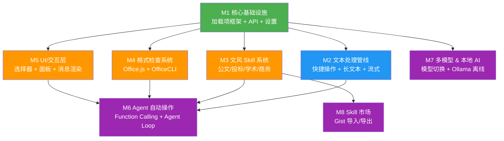
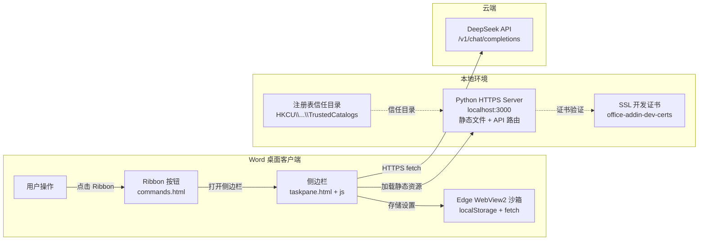
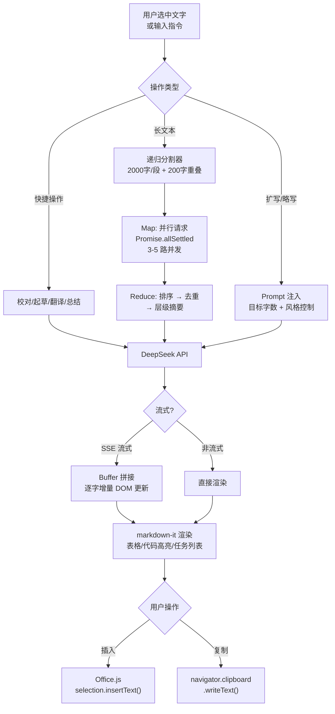
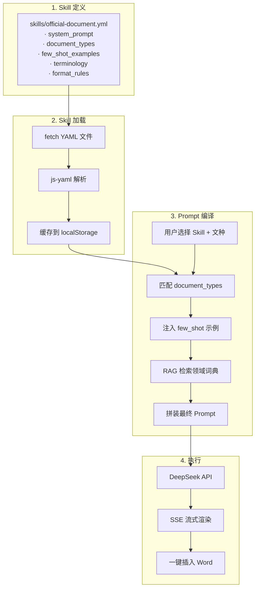
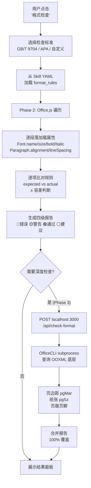
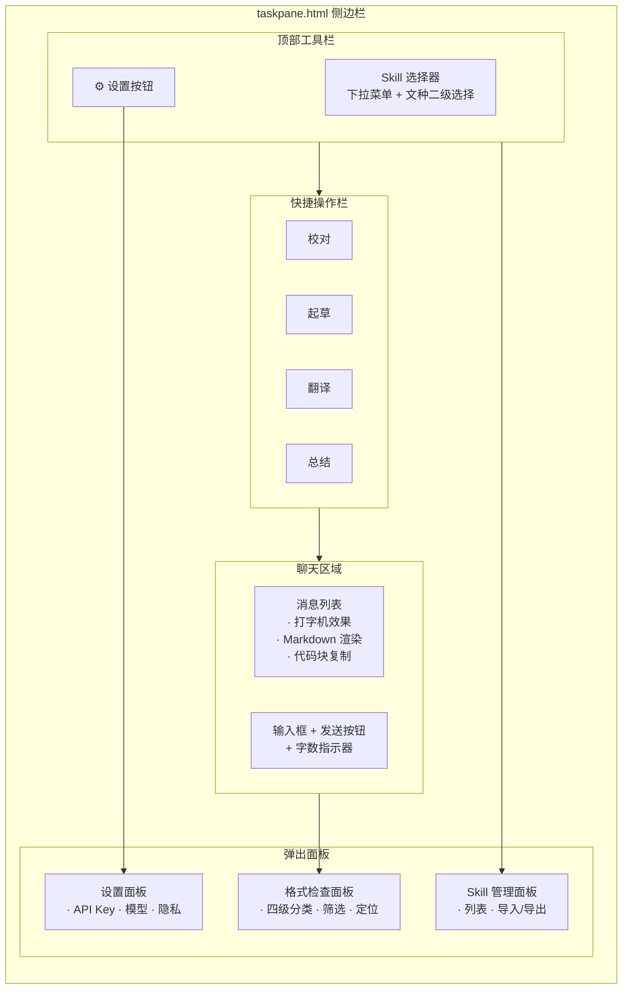
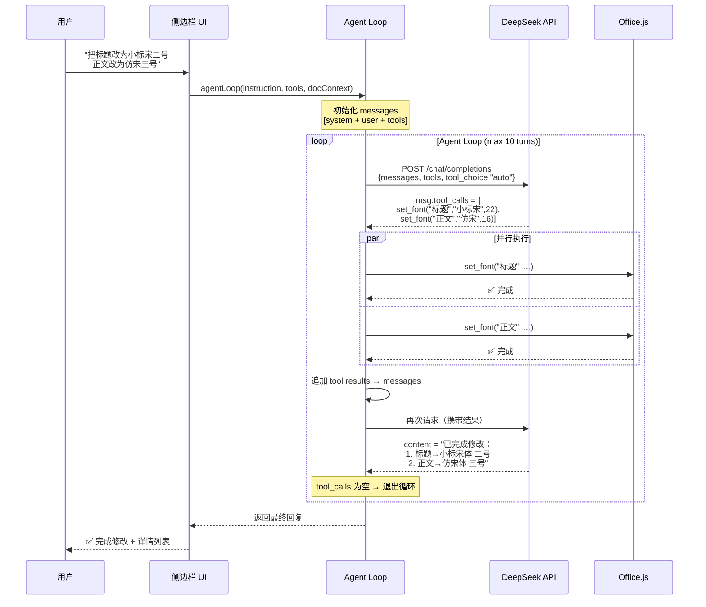
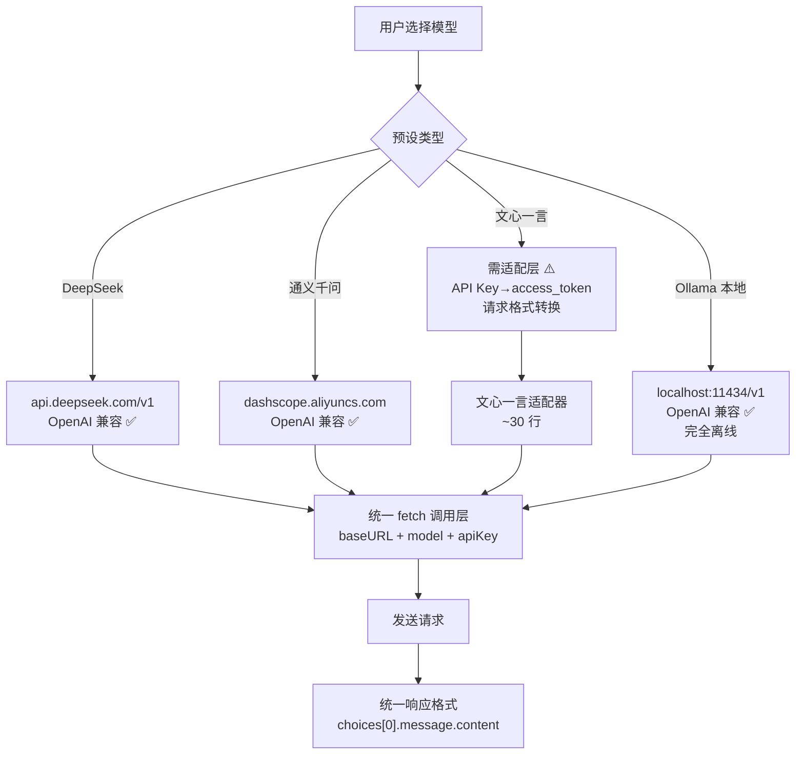
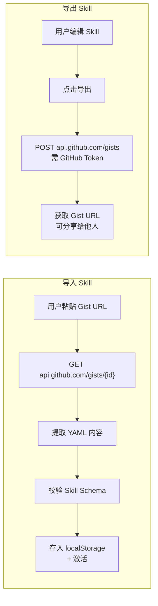

# 架构拆分：按需求模块划分

> **使用方式**：逐模块开发，每完成一项勾选 `- [x]`。每个模块包含需求描述 + 流程图 + 任务清单。
>
> **模块依赖**：`M1 → M2/M3/M4/M5 可并行 → M6/M7/M8 依赖前面`

---

## 模块总览与依赖



| 颜色 | 阶段 | 说明 |
|:---|:---|:---|
| 🟢 绿色 | Phase 1 | 已完成，仅需小幅扩展 |
| 🔵🟠 蓝/橙 | Phase 2 | 当前开发重点，核心差异化 |
| 🟣 紫色 | Phase 3 | 规划中，进阶能力 |

---

## M1 核心基础设施

> **需求来源**：痛点 1（上下文切换打断写作流）、痛点 6（格式是最后一公里）
> **当前状态**：Phase 1 已完成，Phase 2 小幅扩展 API 通信层

### 流程总览



### 1.1 加载项框架与部署

> **需求**：用户能在 Word 侧边栏中使用 AI，安装步骤简单（≤10 分钟）。
> **技术**：Word Web Add-in (taskpane) + Python 本地 HTTPS 服务器 + 注册表信任目录。

- [x] `manifest.xml` — 加载项声明文件（ID、权限、Ribbon 按钮定义）
- [x] `taskpane.html` — 侧边栏主界面，单页面承载所有功能
- [x] `commands.html` — Ribbon 按钮点击后的命令处理
- [x] Python HTTPS 本地服务器 — 托管静态文件，后续可扩展 API 路由
- [x] 开发证书安装 — `npx office-addin-dev-certs install --days 365`
- [x] 注册表信任目录注册 — Python 脚本写入 `HKCU\Software\Microsoft\Office\16.0\WEF\TrustedCatalogs`
- [ ] 打包/分发脚本 — Phase 3：sideload 简化方案，用户无需手动注册
- [ ] Mac 跨平台兼容 — Phase 3：注册表路径在 Mac 上为 `plist` 格式，需适配

### 1.2 API 通信层

> **需求**：前端可靠地与 DeepSeek API 通信，支持后续扩展。
> **技术**：原生 `fetch` + `AbortController`，Phase 2 升级 SSE 流式。

- [x] 基础 `fetch` 封装 — 统一请求头、超时、错误处理
- [x] API Key 注入 — 从 `localStorage` 读取并注入 `Authorization` 头
- [x] `AbortController` 停止生成 — Phase 2：SSE 流式时须支持取消
- [x] SSE 流式解析器 — Phase 2：Buffer 拼接 + JSON 断行处理（~80 行，见 DeepSeekClient.chatStream）
- [x] 请求重试机制 — Phase 2：网络异常自动重试 2 次（间隔 1s→2s；仅聊天请求；流式仅首字节前重试，已出内容绝不重试）
- [x] 请求队列并发控制 — Phase 2：长文本分段时限制 3-5 路并发（已随 M2.2 实现：LongTextProcessor 4 路并发分批）

### 1.3 设置与持久化

> **需求**：用户配置 API Key、模型、Endpoint，设置持久化。
> **技术**：`localStorage`（WebView2 为每个加载项提供隔离存储）。

- [x] API Key 存储与读取 — `localStorage.setItem('apiKey', ...)`
- [x] 模型选择存储 — `deepseek-chat` / `deepseek-coder`
- [x] 自定义 Endpoint 存储 — 默认 `https://api.deepseek.com/v1`
- [x] 测试连接按钮 — 发一条简单请求验证 Key 有效性
- [x] 聊天历史存储（最近 50 条）— 超过自动裁剪，防溢出
- [x] 设置面板 UI — 齿轮图标 → 弹出面板
- [ ] 隐私模式开关 — Phase 2：自动脱敏（电话/身份证/金额替换为 `***`）

### 1.4 文档上下文感知

> **需求**：用户选中文字后，AI 自动感知文档上下文。
> **技术**：Office.js `context.document.getSelection()`。

- [x] 选中文字检测 — `Office.context.document.getSelection()`
- [x] 选中字数显示 — "已选择 XX 字" 状态提示
- [x] 选中文字注入 Prompt — 作为上下文自动随请求发送
- [ ] 全文上下文感知 — Phase 2：长文档场景的分段策略
- [ ] 光标位置追踪 — Phase 3 Agent：AI 需知道光标在哪以精确插入

---

## M2 文本处理管线

> **需求来源**：痛点 1（上下文切换）、痛点 5（长文本处理无力感）
> **当前状态**：Phase 1 有基础快捷操作，Phase 2 重点增强

### 流程总览



### 2.1 快捷操作（校对/起草/翻译/总结）

> **需求**：选中文字 → 点击按钮 → AI 处理 → 一键插入。减少 "写→问→改" 步骤。
> **技术**：预设 System Prompt + 用户选中文字作为 User Message。

- [x] 校对润色 — System prompt："请检查以下文字的语法、用词、流畅度..."
- [x] 起草内容 — System prompt："根据用户指令生成内容..."
- [x] 翻译 — 自动检测中英文并互译，支持其他语言
- [x] 总结要点 — System prompt："提取关键信息，生成要点列表"
- [x] 一键插入文档 — `selection.insertText()`
- [x] 一键复制 — `navigator.clipboard.writeText()`
- [ ] 操作结果反馈 — Phase 2：成功/失败 Toast 通知

### 2.2 长文本分段处理

> **需求**：2 万字报告分段发给 AI 处理（总结/翻译），上下文不能断裂。
> **技术**：自实现递归字符分割器（~50 行），Map-Reduce 模式。

- [x] 递归分割器实现 — 按 `\n\n` → `\n` → `。` → `；` → `，` 优先级递归
- [x] 分段参数配置 — 默认 2000 字/段 + 200 字重叠（滑动窗口）
- [x] 并行 Map 阶段 — `Promise.allSettled()` 3-5 路并发
- [x] Reduce 合并阶段 — 排序 → 边界去重 → 层级摘要生成
- [x] 上下文元信息注入 — 每段带 `[第 N/M 段，前一段摘要：...]`
- [x] 长文本总结（层级摘要）— 一句话结论 → 三段要点 → 逐段摘要
- [ ] 长文本翻译 — 分段翻译 + 术语一致性保持
- [ ] 长文本纠错 — 分段检查 + 跨段一致性验证
- [x] 进度指示器 — "正在处理第 3/10 段..."

### 2.3 扩写/略写模式

> **需求**：根据目标字数智能调整文章篇幅。
> **技术**：纯 Prompt Engineering + 参数控制，不需要额外代码库。

- [x] 扩写模式 — "扩展到约 N 字"，`max_tokens` 调高至 4096
- [x] 略写/压缩模式 — "压缩到约 N 字，保留核心信息"，`temperature` 调低至 0.3
- [x] 保持风格模式 — 传入原文前 200 字作为 few-shot 示例
- [x] UI 字数目标选择器 — 滑块或输入框
- [x] 扩写/略写结果对比 — 原文 vs 处理后字数对比展示

### 2.4 SSE 流式输出

> **需求**：打字机效果逐字显示回复，不用等完整响应。
> **技术**：`fetch` + `ReadableStream`，手动 Buffer 拼接（~80 行）。

- [x] `ReadableStream` 读取器 — `response.body.getReader()`
- [x] Buffer 拼接策略 — 处理 TCP 分包导致的 JSON 截断
- [x] 增量 DOM 更新 — 逐字追加到消息气泡（打字机效果）
- [x] `AbortController` 停止 — 用户点击"停止生成"按钮（发送按钮变身红色停止键）
- [x] 流式完成后 Markdown 渲染 — 当前用自写渲染器；markdown-it 升级见 M2.5
- [x] 流式异常处理 — 网络中断提示 + 保留已生成内容
- [ ] 自动重连 — 可选 `@microsoft/fetch-event-source`（~3KB）（本次明确不做，保持零依赖）

### 2.5 Markdown 渲染增强

> **需求**：AI 回复中的表格、代码块等正确渲染，而非显示原始源码。
> **技术**：markdown-it + highlight.js，约 100KB gzip。

- [ ] markdown-it 集成 — 替换 Phase 1 自写正则渲染器
- [ ] 表格渲染 — `markdown-it-multimd-table`：列对齐、合并单元格
- [ ] 代码高亮 — `highlight.js`：自动语言检测，300+ 主题
- [ ] 任务列表 — `markdown-it-task-lists`：`- [ ]` / `- [x]`
- [ ] 脚注支持 — `markdown-it-footnote`
- [ ] Emoji 支持 — `markdown-it-emoji`：`:smile:` → 😄
- [ ] 代码块复制按钮 — 每块右上角"复制"按钮
- [ ] 渲染性能 — 长回复 ~500ms 内完成

---

## M3 文风 Skill 系统

> **需求来源**：痛点 4（通用 AI 不懂中文办公规矩）、痛点 3.2（AI 腔问题）
> **核心定位**：不是"又一个 AI 聊天插件"，而是"中文专业写作的 AI 技能包"

### 流程总览



### 3.1 Skill 定义格式与解析

> **需求**：用人类可编辑的格式定义写作风格技能包。
> **技术**：YAML 格式 → js-yaml 解析（~35KB gzip，唯一外部依赖）。

- [x] Skill YAML Schema 设计 — 已完成（name/version/system_prompt/document_types/few_shot/terminology/format_rules）
- [x] js-yaml 集成 — 解析 YAML 为 JS 对象（vendored `src/lib/js-yaml.mjs`，唯一外部依赖）
- [x] Skill YAML 校验 — 必填字段检查 + 格式合法性验证（中文错误文案，聚合报告）
- [x] Skill 版本管理 — `version` 字段，升级时提示用户（检测逻辑就绪，可见提示随 M5.1 选择器落地）

### 3.2 Skill 引擎（Prompt 编译）

> **需求**：根据 Skill + 文种 + 用户指令，编译最终 Prompt。
> **技术**：自实现模板编译器（~50 行），纯字符串替换。

- [x] `compileSkillPrompt()` 核心函数 — 编译入口
- [x] `{{#document_types}}` 占位符替换 — 匹配用户选择的文种模板（未选/未命中回退第一个）
- [x] `{{#few_shot_examples}}` 注入 — 最多 3 个示例注入为 few-shot
- [x] `{{user_instruction}}` 注入 — 用户实际指令
- [x] 领域词典 RAG 检索 — 从 terminology 列表匹配相关政治表述（keywords 打分排序取前 5，零命中清空）
- [x] 编译缓存 — 同一 Skill + 相同参数 → 缓存结果（内存 Map，上限 32 条）

### 3.3 内置 Skill 库

> **需求**：开箱即用 4 个核心写作场景 Skill。

- [ ] **党政公文 Skill** `skills/official-document.yml`
    - [ ] 文种模板（通知/报告/请示/函/纪要）— 每种的结构规范
    - [ ] 政治表述库 — 两个维护/四个意识/四个自信 等
    - [ ] few-shot 示例 — 3 个高质量公文示例
    - [ ] GB/T 9704 格式规则 — 标题/正文/页边距标准值
- [ ] **投标文件 Skill** `skills/bidding.yml`
    - [ ] 技术方案文风模板 — 专业/精确/量化指标
    - [ ] 商务方案文风模板 — 商务术语/报价逻辑
    - [ ] 评分标准对照模板 — 加分项覆盖度分析
    - [ ] few-shot 示例 — 3 个高质量投标示例
- [ ] **学术论文 Skill** `skills/academic.yml`
    - [ ] APA 引用格式 — 英文论文
    - [ ] GB/T 7714 引用格式 — 中文论文
    - [ ] 文献综述模板 — 结构化综述框架
    - [ ] few-shot 示例 — 3 个高质量学术示例
- [ ] **商务邮件/报告 Skill** `skills/business.yml`
    - [ ] 正式风格模板 — 对外函件/汇报
    - [ ] 半正式风格模板 — 内部邮件
    - [ ] 口语化风格模板 — 日常沟通
    - [ ] few-shot 示例 — 每种风格各 1 个

### 3.4 Skill 存储与加载

> **需求**：内置 Skill 随加载项发布，用户可创建自定义 Skill。
> **临时方案**：3.3 内置库因缺乏可靠标准来源搁置，先支持用户把标准写在 .md 文档里，AI 提取为自定义 Skill（生成 → 存储 → 激活 → 编译使用闭环已打通）。

- [x] `skills/` 目录加载 — fetch 本地 YAML 文件（SkillLoader，随 M3.1 实现）
- [x] 用户自定义 Skill 存储 — 解析后缓存到 localStorage（CustomSkillStore）
- [x] Skill 列表管理 UI — 查看/删除已完成（生成面板内）；启用/禁用待后续
- [x] Skill 导入（本地文件）— .md/.txt 先行（生成面板文件入口）；.yml 直接导入待后续
- [x] MD 标准文档 → AI 生成 Skill — SkillGenerator：MD → Schema 提示词 → DeepSeek → 剥围栏 → 校验 → 入库（3.3 搁置期间的临时方案）
- [ ] Skill 导出 — 导出为 YAML 文件

---

## M4 格式检查系统

> **需求来源**：痛点 6（格式是最后一公里）、痛点 4.1（公文 GB/T 9704 规范）
> **技术路线**：Phase 2 纯 Office.js（60%）→ Phase 3 OfficeCLI 桥接（100%）

### 流程总览



### 4.1 基础格式检查（Phase 2 — Office.js）

> **需求**：自动检查字体/字号/加粗/对齐等，标注不合规项。
> **技术**：Office.js 遍历段落 → 比对规则 → 四级报告。

- [ ] 字体名检查 — `Font.name` 比对预期字体
- [ ] 字号检查 — `Font.size` 支持容差（±0.5pt）
- [ ] 加粗/斜体检查 — `Font.bold` / `Font.italic`
- [ ] 下划线/颜色检查 — `Font.underline` / `Font.color`
- [ ] 对齐方式检查 — `Paragraph.alignment`
- [ ] 行距检查 — `Paragraph.lineSpacing`（基础值可读，标注建议人工复核）
- [ ] 段落缩进检查 — `Paragraph.leftIndent`（基础值可读，标注建议人工复核）
- [ ] 批量并行加载优化 — `context.load(paragraphs, 'font/alignment/...')` 减少 API 调用
- [ ] 四级报告生成 — 🔴错误 / 🟡警告 / 🟢通过 / ⚪建议深度检查
- [ ] 结果列表 UI — 可点击定位到对应段落

### 4.2 格式规则引擎

> **需求**：规则可从 YAML 加载，支持多种标准。
> **技术**：规则数组 → 遍历比对（~200 行 JS，不需要外部库）。

- [ ] 规则数据模型 — `{selector, checks: [{property, expected, tolerance, severity}]}`
- [ ] 规则加载器 — 从 Skill YAML 的 `format_rules` 字段读取
- [ ] 规则遍历比对引擎 — 逐段落逐属性比对
- [ ] 规则预设管理 — GB/T 9704 / APA / 用户自定义
- [ ] 自定义规则编辑器 — UI 界面添加/修改规则

### 4.3 深度格式检查（Phase 3 — OfficeCLI 桥接）

> **需求**：页边距/页眉页脚/纸张大小等 Office.js 覆盖不到的项。
> **技术**：taskpane → fetch localhost → Python → subprocess OfficeCLI → OOXML → JSON。

- [ ] OfficeCLI 二进制引入 — 按平台下载（Win/Mac/Linux），~30MB
- [ ] Python API 路由 `/api/check-format` — 在现有 HTTPS 服务器上扩 ~30 行
- [ ] 页边距查询 — `sectPr → pgMar`：上 3.7cm 下 3.5cm 左 2.8cm 右 2.6cm
- [ ] 纸张大小查询 — `sectPr → pgSz`：A4 210mm × 297mm
- [ ] 页眉页脚查询 — 内容是否合规
- [ ] 段落缩进精确值 — 区分首行缩进/悬挂缩进
- [ ] GB/T 9704 全量对照 — 一键对照国家标准，100% 覆盖
- [ ] 前后端通信协议 — JSON 格式定义
- [ ] 安装脚本自动下载 OfficeCLI — 首次使用时引导

---

## M5 UI/交互层

> **需求来源**：痛点 2（AI 太吵/入侵感）— UI 应安静、清晰、可忽略
> **当前状态**：Phase 1 有基础 UI，Phase 2 需重构增强

### 组件架构



### 5.1 Skill 选择器

> **需求**：下拉菜单一键切换写作风格，选择后 Prompt 自动切换。

- [x] Skill 下拉菜单 UI — 分组显示（通用/内置 Skill / 自定义 Skill）
- [x] 文档类型二级选择 — 激活 Skill 有多个文种时显示二级下拉
- [x] 当前 Skill 状态指示 — 下拉框回填激活项即指示（图标徽标待后续）
- [ ] Skill 快速切换快捷键 — 可选：键盘快捷切换

### 5.2 格式检查结果面板

> **需求**：结构化展示检查结果，可筛选、可定位。

- [ ] 四级分类展示 — 🔴🟡🟢⚪ 颜色编码
- [ ] 筛选器 — 按严重程度/属性类型筛选
- [ ] 点击定位 — 点击结果项 → 滚动到 Word 对应段落
- [ ] 结果导出 — 导出为文本/Markdown 报告
- [ ] 一键修正（Phase 3）— Agent 自动修改不合规项

### 5.3 设置面板增强

> **需求**：Phase 2 增加模型预设、隐私开关、Skill 管理。

- [ ] 模型预设选择器 — DeepSeek / 通义千问 / 文心一言 / Ollama
- [ ] 隐私模式开关 — 自动脱敏（电话/身份证/金额替换）
- [ ] Skill 管理子面板 — 查看/导入/导出/删除 Skill

### 5.4 聊天消息渲染增强

> **需求**：消息气泡更好看，流式打字效果，长消息折叠。

- [ ] 流式消息打字效果 — 逐字追加到气泡
- [x] 消息操作按钮 — 插入到文档 / 复制（Phase 1 已有）
- [ ] 消息时间戳 — 每条消息显示时间
- [ ] 长消息折叠 — 超过 500 字自动折叠 + "展开全部"
- [ ] 代码块复制按钮 — 每块右上角"复制"
- [ ] 虚拟滚动优化 — 历史 > 100 条时启用 `IntersectionObserver` + DOM 回收

---

## M6 Agent 自动操作（Phase 3）

> **需求**：用户说"把标题改为小标宋二号" → AI 自动调 Office.js 修改文档
> **技术**：自实现 Agent Loop（~150 行），基于 DeepSeek Function Calling

### Agent 交互流程



### 6.1 Function Calling 工具定义

> **需求**：定义 AI 可调用的文档操作工具。
> **技术**：OpenAI-compatible Function Definitions，标准 JSON Schema。

- [ ] `set_font` 工具 — 字体名/字号/加粗/斜体/颜色
- [ ] `set_paragraph_style` 工具 — 段落样式（对齐/行距/缩进）
- [ ] `insert_paragraph` 工具 — 光标位置插入段落
- [ ] `replace_text` 工具 — 查找替换
- [ ] `delete_paragraph` 工具 — 删除指定段落
- [ ] `check_format` 工具 — 触发格式检查
- [ ] `get_document_info` 工具 — 获取文档基本信息（页数/字数/节数）
- [ ] 工具 Schema 校验 — 确保参数类型正确

### 6.2 Agent Loop 实现

> **需求**：AI 自主多轮调用工具，最多 10 轮防死循环。
> **技术**：自实现 while 循环 + tool_call 结果追加。

- [ ] `agentLoop()` 核心函数 — while 循环 + 工具执行 + 结果回传
- [ ] System Prompt — "你是 Word 文档操作助手..."
- [ ] 文档上下文注入 — 当前文档状态（选中/光标/段落数）
- [ ] 最大轮次限制 — 默认 10 轮
- [ ] 工具调用日志 — "正在修改字体..."实时提示
- [ ] Agent 执行状态 UI — 实时显示操作进度
- [ ] 错误处理 — 工具失败 → 通知 AI → 尝试替代方案

### 6.3 工具执行器

> **需求**：将 Function Call 参数翻译为 Office.js 调用。

- [ ] `executeToolCall()` 分发函数 — 按 `function.name` 路由
- [ ] 字体修改执行器 — `Font.name/size/bold/italic/color`
- [ ] 段落操作执行器 — `Paragraph.alignment/leftIndent/lineSpacing`
- [ ] 文本插入/替换执行器 — `selection.insertText()` + search & replace
- [ ] 格式检查执行器 — 调用 M4 的检查引擎
- [ ] 操作结果格式化 — 统一格式返回 AI（成功/失败 + 详情）

---

## M7 多模型 & 本地 AI（Phase 3）

> **需求**：多模型备选 + 政务场景离线需求
> **技术**：所有模型走 OpenAI 兼容接口，仅文心一言需适配

### 模型切换流程



### 7.1 多模型预设切换

> **需求**：设置中一键切换模型。
> **技术**：`MODEL_PRESETS` 配置对象，切换即改 `baseURL` + `model`。

- [ ] 预设配置定义 — DeepSeek / 通义千问 / 文心一言 / Ollama
- [ ] 模型切换 UI — 下拉菜单或卡片选择
- [ ] 自定义预设 — 手动填入任意 OpenAI 兼容端点
- [ ] 模型连接测试 — 切换后自动测试连接
- [ ] Function Calling 兼容检测 — 检查 `tool_calls` 支持（Ollama ≥ v0.1.14）

### 7.2 文心一言适配

> **需求**：文心一言 API 格式不兼容 OpenAI，需独立适配。
> **技术**：~30 行适配函数。

- [ ] API Key + Secret Key → access_token — 调用百度鉴权接口
- [ ] 请求格式转换 — messages 从 OpenAI 格式 → 文心一言格式
- [ ] 响应格式转换 — 统一为 `choices[0].message.content`
- [ ] 流式输出适配 — 文心一言 SSE 格式可能不同

### 7.3 Ollama 本地模型

> **需求**：完全离线运行，政务场景刚需。
> **技术**：Ollama OpenAI 兼容端点（`localhost:11434/v1`）。

- [ ] Ollama 端点对接 — `baseURL: http://localhost:11434/v1`
- [ ] CORS 配置 — 用户侧 `OLLAMA_ORIGINS=*`
- [ ] 模型列表查询 — `GET /v1/models` 获取已安装本地模型
- [ ] 本地模型推荐 — qwen2.5:7b（中文）/ deepseek-r1:8b
- [ ] 离线模式提示 — 检测网络不可达时自动切换 + UI 提示
- [ ] Function Calling 兼容 — Ollama v0.1.14+ 支持

---

## M8 Skill 市场（Phase 3）

> **需求**：社区贡献 Skill，形成网络效应和壁垒
> **技术**：GitHub Gist 作为 Skill 存储后端

### Skill 分享流程



### 8.1 GitHub Gist 导入/导出

> **需求**：用户可从 Gist 导入他人 Skill，也可发布自己的。
> **技术**：GitHub Gist API（公开 Gist 无需鉴权即可读取）。

- [ ] Gist API 读取 — `GET https://api.github.com/gists/{gist_id}`（公开 Gist 无需 Token）
- [ ] 从 Gist URL 导入 — 粘贴 URL → fetch YAML → 校验 → 存入 localStorage
- [ ] 导出到 Gist — 需 GitHub Token，创建/更新 Gist
- [ ] Skill 市场浏览 UI — 内置展示页面
- [ ] 分类/关键词搜索 — 利用 Gist description + topics
- [ ] Skill 评分/使用量 — 可选：简单社区反馈

---

## 开发顺序建议

```
Week 1-2   M1 完善（SSE 流式 + 并发控制 + AbortController）
Week 3-4   M2 文本管线（长文本分段 + 扩写/略写 + Markdown 渲染）
Week 5-7   M3 Skill 系统（引擎 + 4 个内置 Skill 库 YAML）
Week 8-9   M4.1 + M4.2 基础格式检查（Office.js 规则引擎 + 四级报告）
Week 10    M5 UI 集成（Skill 选择器 + 格式检查面板 + 设置增强）
─── Phase 2 上线 ───
Week 11-13 M6 Agent 自动操作（工具定义 + Agent Loop + 执行器）
Week 14-15 M4.3 深度格式检查（OfficeCLI 桥接）
Week 16-17 M7 多模型支持（含 Ollama 本地模型）
Week 18    M8 Skill 市场（Gist 导入/导出）
─── Phase 3 上线 ───
```

> **原则**：每个 Phase 只交付一个核心增量。Phase 2 跑通完整闭环，Phase 3 叠加进阶能力。

---

## 需求到模块的追溯矩阵

| 需求痛点 | 对应模块 | 解决方式 |
|:---|:---|:---|
| 痛点 1：上下文切换打断写作流 | M1 + M2 | 嵌入 Word 侧边栏，选中即操作 |
| 痛点 2：AI 太吵/入侵感 | M5 | UI 安静清晰，用户主动触发 |
| 痛点 3.1：生成内容不可靠 | M2 + M3 | Skill 系统约束输出质量 |
| 痛点 3.2：AI 腔问题 | M3 | few-shot 示例 + 领域词典消除空洞表达 |
| 痛点 4.1：公文写作规范 | M3 + M4 | 公文 Skill + GB/T 9704 格式检查 |
| 痛点 4.2：投标文件场景 | M3 | 投标 Skill 专属文风模板 |
| 痛点 5：长文本处理无力 | M2.2 + M2.4 | 递归分割 + Map-Reduce + 流式 |
| 痛点 6：格式排版比写作更累 | M4 | 自动格式检查 + 四级报告 |
| 痛点 7：格式检查能力边界 | M4.3 | OfficeCLI 本地桥接补齐 40% |
